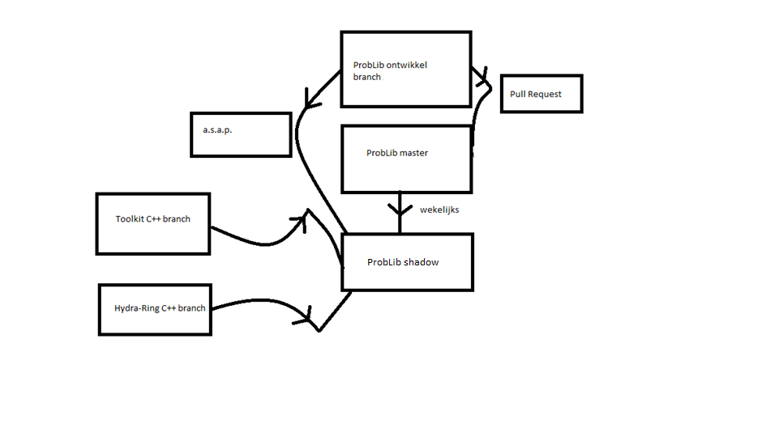

# Probabilistic Library

This is the repository of the Probabilistic Library of Deltares.

The library provides a set of routines that enable reliability analysis of a component or a system of components.

__Calculation techniques for a single component:__
- FORM
- Crude Monte Carlo
- Directional Sampling
- Importance Sampling
- Adaptive Importance Sampling
- Numerical Integration
- Hybrid calculation techniques

__System analysis:__ parallel system, series system.

__Distribution functions:__ deterministic, uniform, normal, (shifted) lognormal, beta, (shifted) exponential, Gumbel, Rayleigh, (conditional) Weibull, Pareto.

__Correlation models:__ Gaussian correlation model.

## Scientific background

The scientific background of the library can be found here: [DOCUMENTATION](doc/scientific_background.tex).

## License

This library is released under the AGPL v3 license. For full text of this license, refer to the [LICENSE](LICENSE) file. 

## Dependencies

## Developer section

1. Automated tests: https://dpcbuild.deltares.nl/project/CGM_main_ProbabilisticLibrary?mode=builds#all-projects

2. Working with branches in Git:

