## Statistics

| | | |
|:-:|:-:|:-:|
| [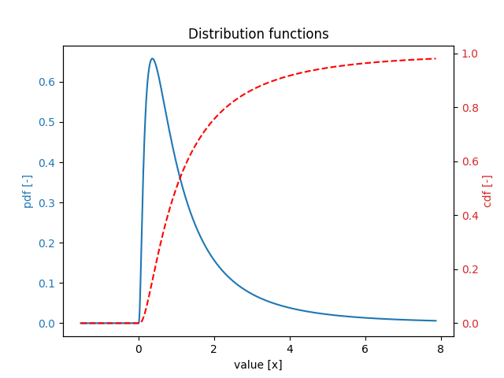](https://github.com/Deltares/ProbabilisticLibrary/blob/master/sources/Deltares.Probabilistic.PWrapper.Notebooks/overview_distribution_functions.ipynb)[Distribution functions](https://github.com/Deltares/ProbabilisticLibrary/blob/master/sources/Deltares.Probabilistic.PWrapper.Notebooks/overview_distribution_functions.ipynb) | [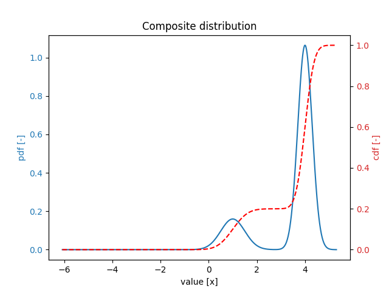](https://github.com/Deltares/ProbabilisticLibrary/blob/master/sources/Deltares.Probabilistic.PWrapper.Notebooks/composite_distribution.ipynb)[Composite distribution](https://github.com/Deltares/ProbabilisticLibrary/blob/master/sources/Deltares.Probabilistic.PWrapper.Notebooks/composite_distribution.ipynb) | [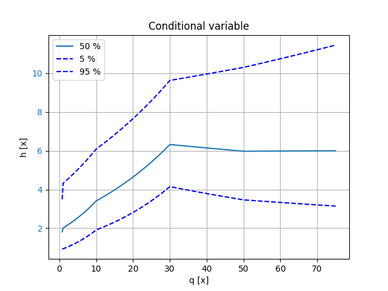](https://github.com/Deltares/ProbabilisticLibrary/blob/master/sources/Deltares.Probabilistic.PWrapper.Notebooks/conditional_variable.ipynb)[Conditional variable](https://github.com/Deltares/ProbabilisticLibrary/blob/master/sources/Deltares.Probabilistic.PWrapper.Notebooks/conditional_variable.ipynb) |
| [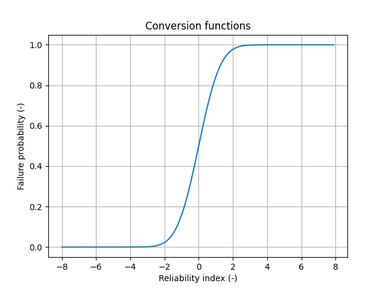](https://github.com/Deltares/ProbabilisticLibrary/blob/master/sources/Deltares.Probabilistic.PWrapper.Notebooks/conversion_functions.ipynb)[Conversion functions](https://github.com/Deltares/ProbabilisticLibrary/blob/master/sources/Deltares.Probabilistic.PWrapper.Notebooks/conversion_functions.ipynb) | [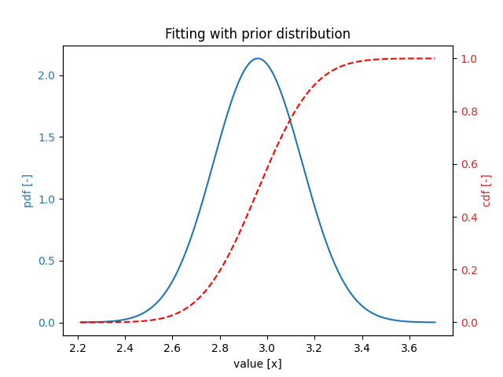](https://github.com/Deltares/ProbabilisticLibrary/blob/master/sources/Deltares.Probabilistic.PWrapper.Notebooks/fitting_with_prior_distribution.ipynb)[Fitting with prior distribution](https://github.com/Deltares/ProbabilisticLibrary/blob/master/sources/Deltares.Probabilistic.PWrapper.Notebooks/fitting_with_prior_distribution.ipynb) | [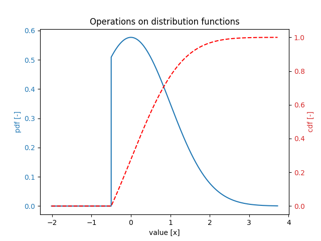](https://github.com/Deltares/ProbabilisticLibrary/blob/master/sources/Deltares.Probabilistic.PWrapper.Notebooks/operations_on_distribution_functions.ipynb)[Operations on distribution functions](https://github.com/Deltares/ProbabilisticLibrary/blob/master/sources/Deltares.Probabilistic.PWrapper.Notebooks/operations_on_distribution_functions.ipynb) |
| [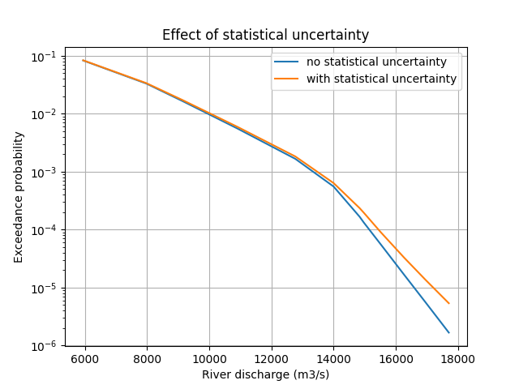](https://github.com/Deltares/ProbabilisticLibrary/blob/master/sources/Deltares.Probabilistic.PWrapper.Notebooks/statistical_uncertainty.ipynb)[Effect of statistical uncertainty](https://github.com/Deltares/ProbabilisticLibrary/blob/master/sources/Deltares.Probabilistic.PWrapper.Notebooks/statistical_uncertainty.ipynb) |   |   |
## Reliability

| | | |
|:-:|:-:|:-:|
| [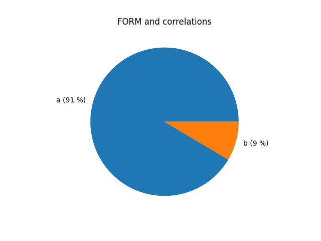](https://github.com/Deltares/ProbabilisticLibrary/blob/master/sources/Deltares.Probabilistic.PWrapper.Notebooks/FORM_simple_correlations.ipynb)[FORM and correlations](https://github.com/Deltares/ProbabilisticLibrary/blob/master/sources/Deltares.Probabilistic.PWrapper.Notebooks/FORM_simple_correlations.ipynb) | [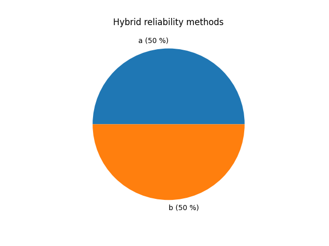](https://github.com/Deltares/ProbabilisticLibrary/blob/master/sources/Deltares.Probabilistic.PWrapper.Notebooks/hybrid_reliability_methods.ipynb)[Hybrid reliability methods](https://github.com/Deltares/ProbabilisticLibrary/blob/master/sources/Deltares.Probabilistic.PWrapper.Notebooks/hybrid_reliability_methods.ipynb) | [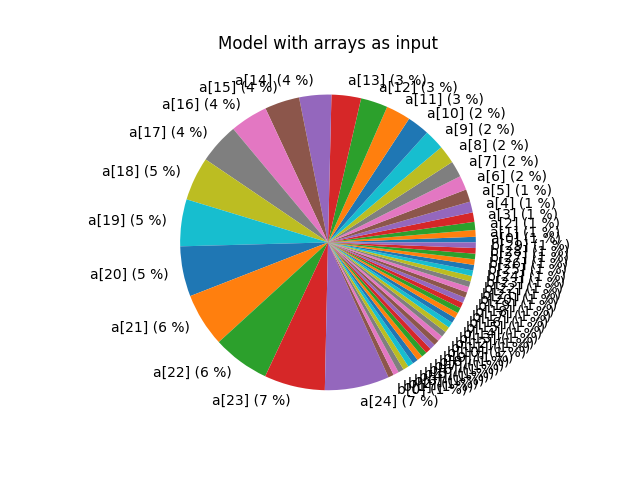](https://github.com/Deltares/ProbabilisticLibrary/blob/master/sources/Deltares.Probabilistic.PWrapper.Notebooks/limit_state_function_with_arrays.ipynb)[Model with arrays as input](https://github.com/Deltares/ProbabilisticLibrary/blob/master/sources/Deltares.Probabilistic.PWrapper.Notebooks/limit_state_function_with_arrays.ipynb) |
| [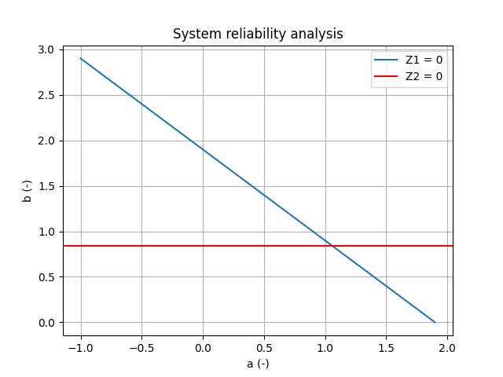](https://github.com/Deltares/ProbabilisticLibrary/blob/master/sources/Deltares.Probabilistic.PWrapper.Notebooks/reliability_analysis_system.ipynb)[System reliability analysis](https://github.com/Deltares/ProbabilisticLibrary/blob/master/sources/Deltares.Probabilistic.PWrapper.Notebooks/reliability_analysis_system.ipynb) | [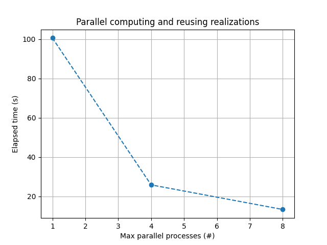](https://github.com/Deltares/ProbabilisticLibrary/blob/master/sources/Deltares.Probabilistic.PWrapper.Notebooks/parallel_overtopping.ipynb)[Parallel computing and reusing realizations](https://github.com/Deltares/ProbabilisticLibrary/blob/master/sources/Deltares.Probabilistic.PWrapper.Notebooks/parallel_overtopping.ipynb) | [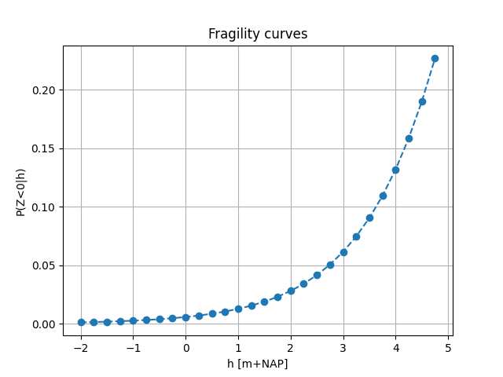](https://github.com/Deltares/ProbabilisticLibrary/blob/master/sources/Deltares.Probabilistic.PWrapper.Notebooks/failure_probability_fragility_curve.ipynb)[Fragility curves](https://github.com/Deltares/ProbabilisticLibrary/blob/master/sources/Deltares.Probabilistic.PWrapper.Notebooks/failure_probability_fragility_curve.ipynb) |
| [Spatial upscaling (length-effect)](https://github.com/Deltares/ProbabilisticLibrary/blob/master/sources/Deltares.Probabilistic.PWrapper.Notebooks/length_effect.ipynb) | [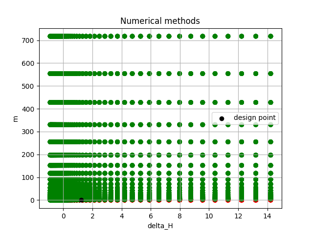](https://github.com/Deltares/ProbabilisticLibrary/blob/master/sources/Deltares.Probabilistic.PWrapper.Notebooks/reliability_methods_bligh.ipynb)[Numerical methods](https://github.com/Deltares/ProbabilisticLibrary/blob/master/sources/Deltares.Probabilistic.PWrapper.Notebooks/reliability_methods_bligh.ipynb) | [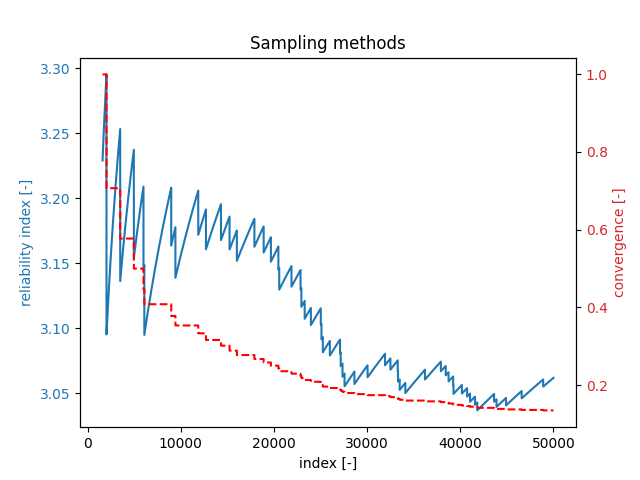](https://github.com/Deltares/ProbabilisticLibrary/blob/master/sources/Deltares.Probabilistic.PWrapper.Notebooks/reliability_methods_hunt.ipynb)[Sampling methods](https://github.com/Deltares/ProbabilisticLibrary/blob/master/sources/Deltares.Probabilistic.PWrapper.Notebooks/reliability_methods_hunt.ipynb) |
| [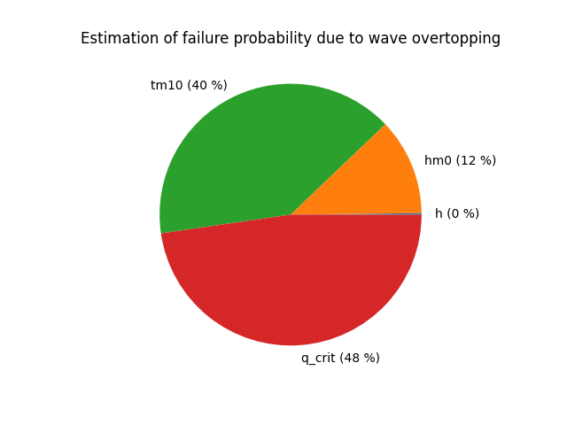](https://github.com/Deltares/ProbabilisticLibrary/blob/master/sources/Deltares.Probabilistic.PWrapper.Notebooks/reliability_methods_overtopping.ipynb)[Gradient methods (FORM, Cobyla)](https://github.com/Deltares/ProbabilisticLibrary/blob/master/sources/Deltares.Probabilistic.PWrapper.Notebooks/reliability_methods_overtopping.ipynb) | [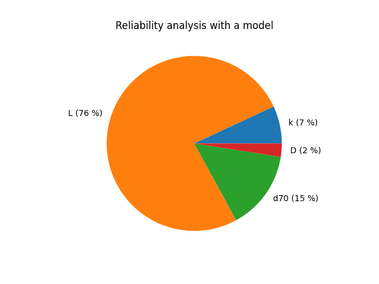](https://github.com/Deltares/ProbabilisticLibrary/blob/master/sources/Deltares.Probabilistic.PWrapper.Notebooks/reliability_with_piping_model.ipynb)[Reliability analysis with a model](https://github.com/Deltares/ProbabilisticLibrary/blob/master/sources/Deltares.Probabilistic.PWrapper.Notebooks/reliability_with_piping_model.ipynb) | [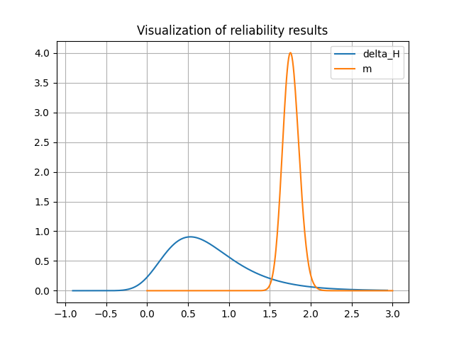](https://github.com/Deltares/ProbabilisticLibrary/blob/master/sources/Deltares.Probabilistic.PWrapper.Notebooks/visualize_results.ipynb)[Visualization of reliability results](https://github.com/Deltares/ProbabilisticLibrary/blob/master/sources/Deltares.Probabilistic.PWrapper.Notebooks/visualize_results.ipynb) |
## Uncertainty

| | | |
|:-:|:-:|:-:|
| [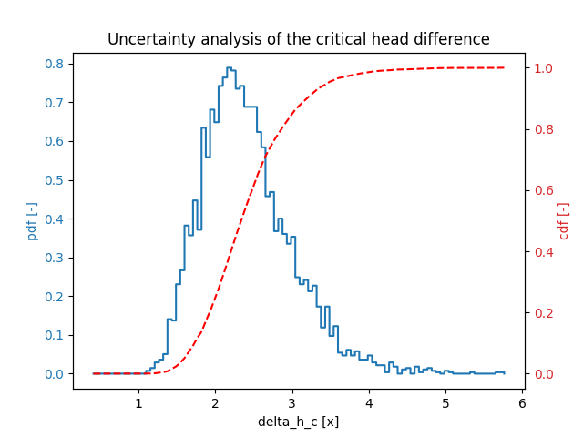](https://github.com/Deltares/ProbabilisticLibrary/blob/master/sources/Deltares.Probabilistic.PWrapper.Notebooks/uncertainty_analysis.ipynb)[Uncertainty analysis](https://github.com/Deltares/ProbabilisticLibrary/blob/master/sources/Deltares.Probabilistic.PWrapper.Notebooks/uncertainty_analysis.ipynb) | [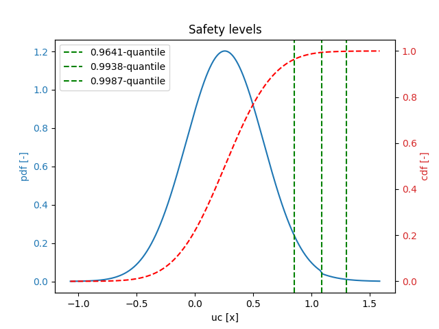](https://github.com/Deltares/ProbabilisticLibrary/blob/master/sources/Deltares.Probabilistic.PWrapper.Notebooks/safety_levels.ipynb)[Safety levels](https://github.com/Deltares/ProbabilisticLibrary/blob/master/sources/Deltares.Probabilistic.PWrapper.Notebooks/safety_levels.ipynb) | [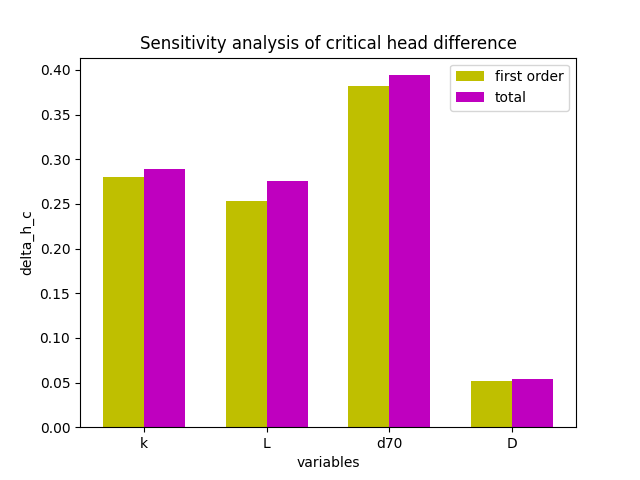](https://github.com/Deltares/ProbabilisticLibrary/blob/master/sources/Deltares.Probabilistic.PWrapper.Notebooks/sensitivity_analysis.ipynb)[Sensitivity analysis](https://github.com/Deltares/ProbabilisticLibrary/blob/master/sources/Deltares.Probabilistic.PWrapper.Notebooks/sensitivity_analysis.ipynb) |
## Model

| | | |
|:-:|:-:|:-:|
| [Running a single calculation](https://github.com/Deltares/ProbabilisticLibrary/blob/master/sources/Deltares.Probabilistic.PWrapper.Notebooks/run_model.ipynb) | [Validation](https://github.com/Deltares/ProbabilisticLibrary/blob/master/sources/Deltares.Probabilistic.PWrapper.Notebooks/validation.ipynb) |   |
