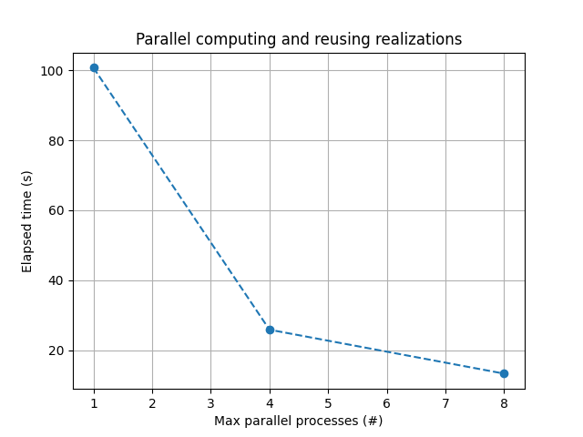
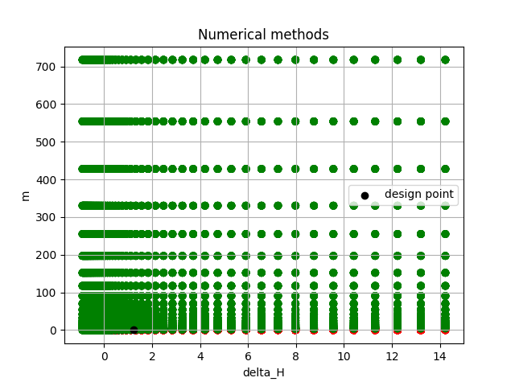

.. |12_img| image:: overview_distribution_functions.png
   :width: 180px
   :alt: Distribution functions

.. |12_nb| replace:: `Distribution functions <../_examples/overview_distribution_functions.ipynb>`__

.. |1_img| image:: composite_distribution.png
   :width: 180px
   :alt: Composite distribution

.. |1_nb| replace:: `Composite distribution <../_examples/composite_distribution.ipynb>`__

.. |2_img| image:: conditional_variable.png
   :width: 180px
   :alt: Conditional variable

.. |2_nb| replace:: `Conditional variable <../_examples/conditional_variable.ipynb>`__

.. |3_img| image:: conversion_functions.png
   :width: 180px
   :alt: Conversion functions

.. |3_nb| replace:: `Conversion functions <../_examples/conversion_functions.ipynb>`__

.. |4_img| image:: correlations.png
   :width: 180px
   :alt: Correlations between variables

.. |4_nb| replace:: `Correlations between variables <../_examples/correlations.ipynb>`__

.. |6_img| image:: fitting_with_prior_distribution.png
   :width: 180px
   :alt: Fitting with prior distribution

.. |6_nb| replace:: `Fitting with prior distribution <../_examples/fitting_with_prior_distribution.ipynb>`__

.. |11_img| image:: operations_on_distribution_functions.png
   :width: 180px
   :alt: Operations on distribution functions

.. |11_nb| replace:: `Operations on distribution functions <../_examples/operations_on_distribution_functions.ipynb>`__

.. |22_img| image:: statistical_uncertainty.png
   :width: 180px
   :alt: Effect of statistical uncertainty

.. |22_nb| replace:: `Effect of statistical uncertainty <../_examples/statistical_uncertainty.ipynb>`__

.. |7_img| image:: FORM_simple_correlations.png
   :width: 180px
   :alt: FORM and correlations

.. |7_nb| replace:: `FORM and correlations <../_examples/FORM_simple_correlations.ipynb>`__

.. |8_img| image:: hybrid_reliability_methods.png
   :width: 180px
   :alt: Hybrid reliability methods

.. |8_nb| replace:: `Hybrid reliability methods <../_examples/hybrid_reliability_methods.ipynb>`__

.. |10_img| image:: limit_state_function_with_arrays.png
   :width: 180px
   :alt: Model with arrays as input

.. |10_nb| replace:: `Model with arrays as input <../_examples/limit_state_function_with_arrays.ipynb>`__

.. |14_img| image:: reliability_analysis_system.png
   :width: 180px
   :alt: System reliability analysis

.. |14_nb| replace:: `System reliability analysis <../_examples/reliability_analysis_system.ipynb>`__

.. |13_nb| replace:: `Parallel computing and reusing realizations <../_examples/parallel_overtopping.ipynb>`__

.. |5_img| image:: failure_probability_fragility_curve.png
   :width: 180px
   :alt: Fragility curves

.. |5_nb| replace:: `Fragility curves <../_examples/failure_probability_fragility_curve.ipynb>`__

.. |9_img| image:: length_effect.png
   :width: 180px
   :alt: Spatial upscaling (length-effect)

.. |9_nb| replace:: `Spatial upscaling (length-effect) <../_examples/length_effect.ipynb>`__

.. |15_nb| replace:: `Numerical methods <../_examples/reliability_methods_bligh.ipynb>`__

.. |16_img| image:: reliability_methods_hunt.png
   :width: 180px
   :alt: Sampling methods

.. |16_nb| replace:: `Sampling methods <../_examples/reliability_methods_hunt.ipynb>`__

.. |17_img| image:: reliability_methods_overtopping.png
   :width: 180px
   :alt: Gradient methods (FORM, Cobyla)

.. |17_nb| replace:: `Gradient methods (FORM, Cobyla) <../_examples/reliability_methods_overtopping.ipynb>`__

.. |18_img| image:: reliability_with_piping_model.png
   :width: 180px
   :alt: Reliability analysis with a model

.. |18_nb| replace:: `Reliability analysis with a model <../_examples/reliability_with_piping_model.ipynb>`__

.. |25_img| image:: visualize_results.png
   :width: 180px
   :alt: Visualization of reliability results

.. |25_nb| replace:: `Visualization of reliability results <../_examples/visualize_results.ipynb>`__

.. |23_img| image:: uncertainty_analysis.png
   :width: 180px
   :alt: Uncertainty analysis

.. |23_nb| replace:: `Uncertainty analysis <../_examples/uncertainty_analysis.ipynb>`__

.. |20_img| image:: safety_levels.png
   :width: 180px
   :alt: Safety levels

.. |20_nb| replace:: `Safety levels <../_examples/safety_levels.ipynb>`__

.. |21_img| image:: sensitivity_analysis.png
   :width: 180px
   :alt: Sensitivity analysis

.. |21_nb| replace:: `Sensitivity analysis <../_examples/sensitivity_analysis.ipynb>`__

.. |19_img| image:: run_model.png
   :width: 180px
   :alt: Running a single calculation

.. |19_nb| replace:: `Running a single calculation <../_examples/run_model.ipynb>`__

.. |24_img| image:: validation.png
   :width: 180px
   :alt: Validation

.. |24_nb| replace:: `Validation <../_examples/validation.ipynb>`__

Statistics
---------

+-------------------------------+-------------------------------+-------------------------------+
| |12_img|                      | |1_img|                       | |2_img|                       |
| |12_nb|                       | |1_nb|                        | |2_nb|                        |
+-------------------------------+-------------------------------+-------------------------------+
| |3_img|                       | |4_img|                       | |6_img|                       |
| |3_nb|                        | |4_nb|                        | |6_nb|                        |
+-------------------------------+-------------------------------+-------------------------------+
| |11_img|                      | |22_img|                      |                               |
| |11_nb|                       | |22_nb|                       |                               |
+-------------------------------+-------------------------------+-------------------------------+

Reliability
---------

+-------------------------------+-------------------------------+-------------------------------+
| |7_img|                       | |8_img|                       | |10_img|                      |
| |7_nb|                        | |8_nb|                        | |10_nb|                       |
+-------------------------------+-------------------------------+-------------------------------+
| |14_img|                      | |13_img|                      | |5_img|                       |
| |14_nb|                       | |13_nb|                       | |5_nb|                        |
+-------------------------------+-------------------------------+-------------------------------+
| |9_img|                       | |15_img|                      | |16_img|                      |
| |9_nb|                        | |15_nb|                       | |16_nb|                       |
+-------------------------------+-------------------------------+-------------------------------+
| |17_img|                      | |18_img|                      | |25_img|                      |
| |17_nb|                       | |18_nb|                       | |25_nb|                       |
+-------------------------------+-------------------------------+-------------------------------+

Uncertainty
---------

+-------------------------------+-------------------------------+-------------------------------+
| |23_img|                      | |20_img|                      | |21_img|                      |
| |23_nb|                       | |20_nb|                       | |21_nb|                       |
+-------------------------------+-------------------------------+-------------------------------+

Model
---------

+-------------------------------+-------------------------------+-------------------------------+
| |19_img|                      | |24_img|                      |                               |
| |19_nb|                       | |24_nb|                       |                               |
+-------------------------------+-------------------------------+-------------------------------+

.. toctree::
   :maxdepth: 1
   :caption: Tutorials

   ../_examples/overview_distribution_functions.ipynb
   ../_examples/composite_distribution.ipynb
   ../_examples/conditional_variable.ipynb
   ../_examples/conversion_functions.ipynb
   ../_examples/correlations.ipynb
   ../_examples/fitting_with_prior_distribution.ipynb
   ../_examples/operations_on_distribution_functions.ipynb
   ../_examples/statistical_uncertainty.ipynb
   ../_examples/FORM_simple_correlations.ipynb
   ../_examples/hybrid_reliability_methods.ipynb
   ../_examples/limit_state_function_with_arrays.ipynb
   ../_examples/reliability_analysis_system.ipynb
   ../_examples/parallel_overtopping.ipynb
   ../_examples/failure_probability_fragility_curve.ipynb
   ../_examples/length_effect.ipynb
   ../_examples/reliability_methods_bligh.ipynb
   ../_examples/reliability_methods_hunt.ipynb
   ../_examples/reliability_methods_overtopping.ipynb
   ../_examples/reliability_with_piping_model.ipynb
   ../_examples/visualize_results.ipynb
   ../_examples/uncertainty_analysis.ipynb
   ../_examples/safety_levels.ipynb
   ../_examples/sensitivity_analysis.ipynb
   ../_examples/run_model.ipynb
   ../_examples/validation.ipynb
